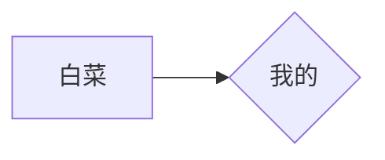
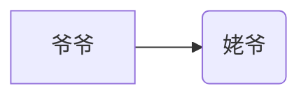
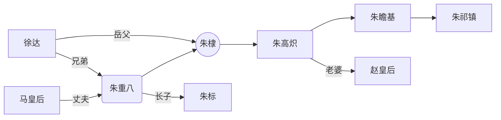

>暑假下乡

我的一个想法是我想下乡，
这也是我一直以来的想法，但是需要注意的是
```
陈接耳机
```
## 公式的写法也是非常好的
我的带一个公式
## 流程图
尝试一下是这个理

```mermaid
graph LR
A[白菜]-->D{我的}

```

```mermaid
graph LR
hjfejf[爷爷] --> C(姥爷)
```

```mermaid
graph LR
朱重八(朱重八)-->朱棣((朱棣))-->朱高炽-->朱瞻基-->朱祁镇
马皇后--丈夫-->朱重八
徐达--兄弟-->朱重八
徐达--岳父-->朱棣
朱重八--长子-->朱标
朱高炽--老婆-->赵皇后

```
<!--stackedit_data:
eyJoaXN0b3J5IjpbLTY1NjU2NjAxM119
-->